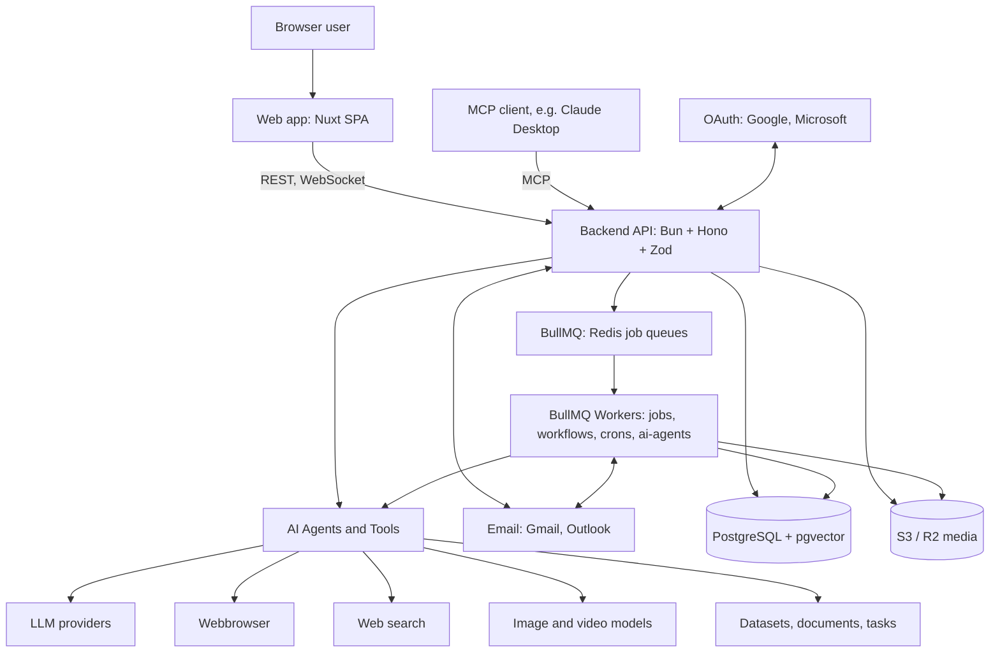

# Architecture

Reference doc, not a PRD: no `Status:` line.



## Repository layout

```
apps/
  web/          Nuxt 4 SPA (shadcn-vue, Tailwind v4)            :3000
  api/          Hono REST + WebSocket + MCP API                 :3010
  worker/       BullMQ job processors, workflow engine, crons
  webbrowser/   Scraping and browser automation service         :3011
packages/
  database/     Drizzle ORM schema and migrations (Postgres + pgvector)
  auth/         better-auth (Google, Microsoft) and MCP OAuth
  ai/           Vercel AI SDK provider setup and agent tools
  queue/        BullMQ queues, job DTOs
  workflow/     Workflow definitions, validation, cron helpers
  editor/       Tiptap v3 editor kit
  mail/ media/ storage/ export/ linkedin/ logger/ config/ utils/ testing/
```

## Stack

- **Stack:** TypeScript end to end, pnpm workspaces + Turborepo, tsdown builds, oxlint + oxfmt
- **Agents:** Vercel AI SDK. Each tool is defined once and adapted for chat, workflows, and MCP.
- **Workflows:** a hand-written interpreter over a JSON graph. No user code runs. Users compose a closed catalog of nodes.
- **Tests:** API integration tests against a real Postgres and Redis ([apps/api/test](../apps/api/test/README.md))
